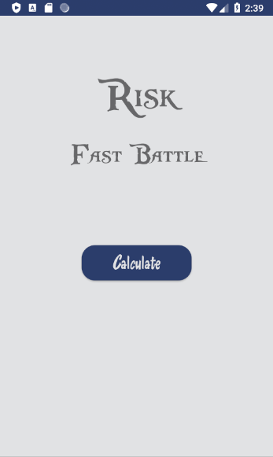
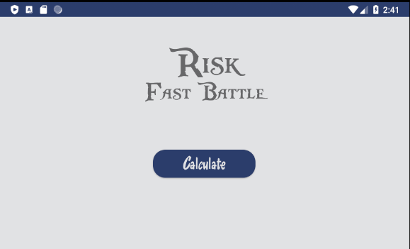
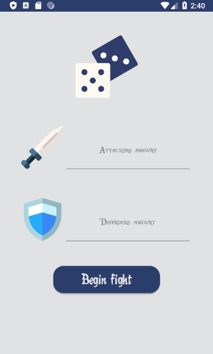
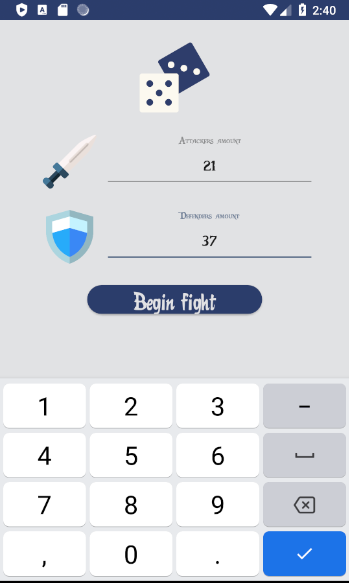
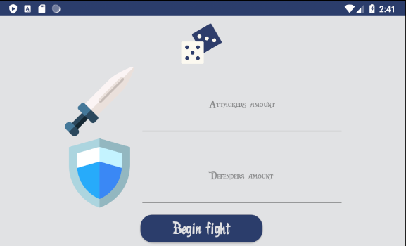
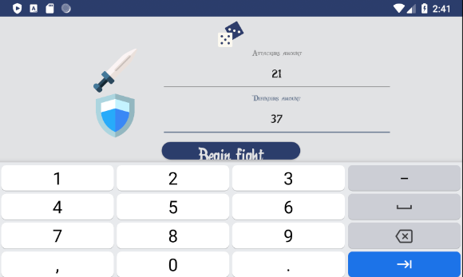
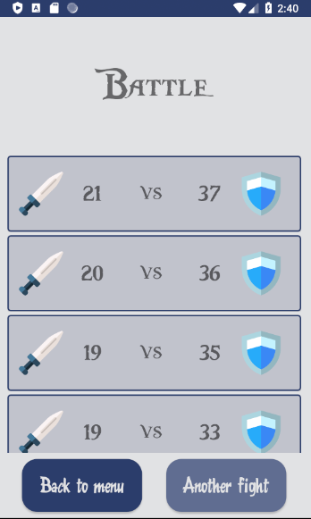
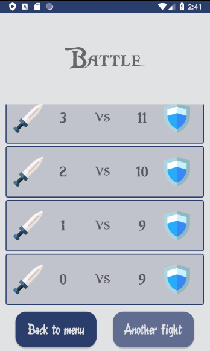
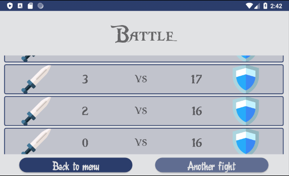

RiskFastBattle is an app that makes Risk Battles faster. You don't have to throw dices n times. You just enter attacker's & defender's info and applications randomly throws dices for you. 

Main menu is simple: 

Entering numbers:

Possible results: 

